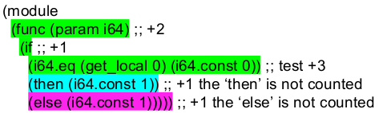
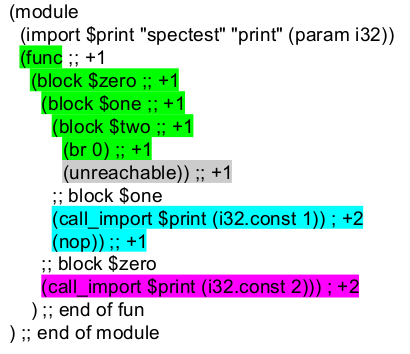

# Metering in WASM
Metering can be accomplished by injecting the counting code into the AST then passing the modified AST to a canonical WASM VM. Modifying the AST is done by traversing the AST and adding a gas check immediately after each branch condition and at the start of functions and loops.

```
+------------+                   +----------------+       +-----------------+
|            |  inject metering  |                |  run  |                 |
| Wasm Code  +------------------>+  Metered code  +------>+ WASM Environment|
|            |                   |                |       |                 |
+------------+                   +----------------+       +-----------------+
```


## Metering by Branch
Metering is done by counting the cost of running a continuous subtree of the AST.  Continuous is defined by subtrees that do not contain any branch conditions. Any time a branch in the AST is reached by the VM gas for that entire subtree is immediately deducted. There are two rules for determining the continuous subtrees;

1. For If Else statements the `then` and `else` statements become new subtrees.
2. For branches (`br`, `br_table`) existing in a enclosing construct; all immediately following statements in that enclosing construct becomes a new subtree.

Currently each opcode is measused as 1 unit of gas. Functions, Parameters to functions and Result values are also counted as  1 unit of gas.

## TODO
* Speficy a cost table for Ethereum System calls
* Speficy cost for memory

## Examples
The examples are in S-expressions which have a near 1 to 1 representation to binary WASM. They also show one possible tranformation to inject metering into canonical WASM code. These examples where generated with a [metering prototype](https://github.com/wanderer/wasm-metering)
### Basic
This would cost two gas to run
```
(module
  (func ;;+1
    (i64.const 1))) ;; +1
```
This code can be transformed to 
```
(module
  (func
    (call_import 0
      (i32.const 2))
    (i64.const 1))
  (import "ethereum" "gasAdd"
    (param i32)))
```
This then can be ran on a canonical WASM VM with the [Ethereum Interface](https://github.com/ethereum/evm2.0-design/blob/master/eth_interface.md) 

### If Else
This is an example of rule `1.` There is an if else statement which creates 3 subtree. 


This code can be transformed to 
```
(module
  (func
    (param i64)
    (call_import 0
      (i32.const 6))
    (if
      (i64.eq (get_local 0) (i64.const 0))
      (then
        (call_import 0
          (i32.const 1))
        (i64.const 1))
      (else
        (call_import 0
          (i32.const 1))
        (i64.const 1))))
  (import "ethereum" "gasAdd"
    (param i32)))
```
### Blocks and Branches
This is an example of rule `2`. This AST gets broken up into 4 subtrees. One is unreachable so it does not need to be metered



This code can be transformed to 

```
(module
  (import $print "spectest" "print"
    (param i32))
  (func
    (call_import 1
      (i32.const 5))
    (block $zero
      (block $one
        (block $two
          (br 0)
          (unreachable)
        (call_import 1
          (i32.const 3))
        (call_import $print
          (i32.const 1))
        (nop))
      (call_import 1
        (i32.const 2))
      (call_import $print
        (i32.const 2))))
  (import "ethereum" "gasAdd"
    (param i32)))
```
